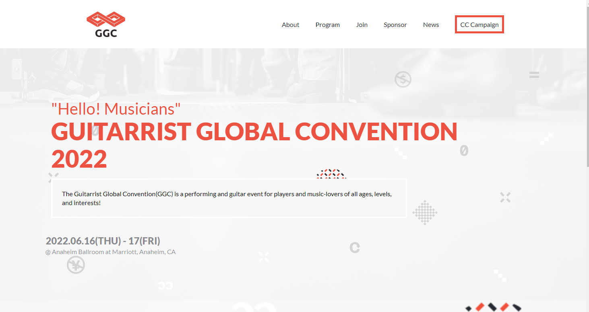

<a name="readme-top"></a>

<div align="center">

  
  <br/>

  <h3><b>Concert Conference</b></h3>

</div>

<!-- TABLE OF CONTENTS -->

# 📗 Table of Contents

- [📖 About the Project](#about-project)
  - [🛠 Built With](#built-with)
    - [Tech Stack](#tech-stack)
    - [Key Features](#key-features)
  - [🚀 Live Demo](#live-demo)
- [💻 Getting Started](#getting-started)
  - [Setup](#setup)
  - [Prerequisites](#prerequisites)
  - [Install](#install)
  - [Usage](#usage)
- [👥 Authors](#authors)
- [🔭 Future Features](#future-features)
- [🤝 Contributing](#contributing)
- [⭐️ Show your support](#support)
- [🙏 Acknowledgements](#acknowledgements)
- [❓ FAQ](#faq)
- [📝 License](#license)


# 📖 GUITARRIST GLOBAL CONVENTION 2022 <a name="about-project"></a>


> This repository serves as a platform to display a sophisticatedly crafted custom-designed guitar convention page, expertly developed with advanced technologies including HTML, CSS, and JavaScript. It boasts a striking design created by the highly acclaimed designer, [Cindy Shin](https://www.behance.net/adagio07), as showcased in her portfolio on Behance. The project encompasses both the homepage and about page, delivering a comprehensive and seamless user experience. .

## 🛠 Built With <a name="built-with"></a>

### Tech Stack <a name="tech-stack"></a>

> Javacript  
> CSS3
> Html

<details>
  <summary>Client</summary>
  <ul>
    <li><a href="https://code.visualstudio.com/">VSCode</a></li>
    <li><a href="https://developer.mozilla.org/">JavaScript</a></li>
  </ul>
</details>


### Key Features <a name="key-features"></a>

- **The Home page consist of the program information and musicians**
- **The About page shows more details of the program and also past events**
- **A navigation button to toggle a popup in mobile version**

<p align="right">(<a href="#readme-top">back to top</a>)</p>


## 🚀 Live Demo <a name="live-demo"></a>


- [GitHub Pages Live Demo](https://taldr27.github.io/Capstone1-Project/)


<p align="right">(<a href="#readme-top">back to top</a>)</p>

## Image preview:

<div>
  
</div>


## 💻 Getting Started <a name="getting-started"></a>

To get a local copy up and running, follow these steps:

### Prerequisites
In order to run this project you need:

> - Git
> - Visual Studio Code


### Setup

Clone this repository to your desired folder:

```
git clone https://github.com/taldr27/Capstone1-Project.git

cd capstone1-project
```

### Install

Install dependencies of this project with:

```
npm install
```

<p align="right">(<a href="#readme-top">back to top</a>)</p>

<!-- AUTHORS -->

## 👥 Author <a name="authors"></a>

👤 **Diego Garcia**

- GitHub: [@taldr27](https://github.com/taldr27)
- LinkedIn: [diegogarcial](https://www.linkedin.com/in/diegogarcial/)

<p align="right">(<a href="#readme-top">back to top</a>)</p>

## 🔭 Future Features <a name="future-features"></a>


- [ ] **The Join page where you can enter a register to participate**
- [ ] **Show the sponsors page**
- [ ] **Improve the navigation of mobile implementing new redirection links**


<!-- CONTRIBUTING -->

## 🤝 Contributing <a name="contributing"></a>

Contributions, issues, and feature requests are welcome!

Feel free to check the [issues page](../../issues/).


<!-- SUPPORT -->

## ⭐️ Show your support <a name="support"></a>


If you like this project, please give a start and suggest possible changes 
to make it better. We'll be more than happy to help


## ❓ FAQ <a name="faq"></a>


- **Do I need to install linters?**

  - Yes you do. If you want to check for any errors inside the project. 

- **Do I need to be connected to the Internet?**

  - No, you can run this project in your local machine.


## 🙏 Acknowledgments <a name="acknowledgements"></a>

I would like to thank Microverse for providing the guide to build this project
- The Creative license is also credited to [Chindy Shindy](https://www.behance.net/adagio07)

## 📝 License <a name="license"></a>

This project is [MIT](./LICENSE) licensed.

<p align="right">(<a href="#readme-top">back to top</a>)</p>
